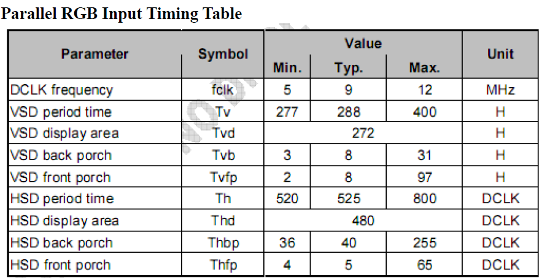

lcd user guide
=====================================

:link_to_translation:`en:[English]`

1、功能概述
--------------------

	本文档主要介绍了Display的API使用，

2、参考代码
--------------------

	参考工程为 `DOORBELL工程 <../../projects_work/media/doorbell/index.html>`_

	参考组件代码在 ``components\display_service``

	Display驱动代码参考 `display驱动 <../../api-reference/multi_media/bk_display.html>`_

3、LCD 驱动接口
----------------------------

LCD Display模块支持3种LCD硬件接口，分别为I(intel)8080接口，RGB接口和QSPI接口。

3.1、8080 接口
***************************************

 - 支持MCU8080接口，数据支持最大18线DB[17:0]
 - 支持输入数据格式：RGB565, RGB888,YUV422
 - 支持TE中断
 - 支持输出的数据格式为RGB565，使用的D[7:0]8线传输
 - 支持输出RGB666，使用的D[17:0]18线传输
 - 支持输出 RGB888，包括16线输出和8线输出
 - 支持最大的刷屏时钟为80Mhz，支持的屏幕分辨率有屏幕类型与分辨率规格见 `外设支持 <../../support_peripherals/index.html>`_

3.2、RGB 接口
***************************************

 - 数据支持最大24线，包括R,G,B 各8根
 - 支持输入数据格式：RGB565, RGB888,YUV422
 - 支持输出的数据格式：RGB565, RGB666, RGB888
 - 最大刷屏时钟为80Mhz，支持的屏幕分辨率有屏幕类型与分辨率规格见 `外设支持 <../../support_peripherals/index.html>`_

3.3、QSPI接口
***************************************

 - QSPI的用户使用代码请参考 ``components\display_service\src\lcd_qspi_display_service.c``
 - QSPI的驱动代码请参考 ``bk_idk\middleware\driver\lcd\lcd_qspi_driver.c``

4、 新增屏幕适配
-----------------------------

1) 用户在 ``.components/bk_peripheral/src/lcd`` 路径下新增屏幕，具体可以参考其中某一个屏幕，比如新增lcd_xxx.c。

2) 针对RGB屏幕需要根据lcd spec 修改hsync/vsync proch，取值范围参考 ``./include/lcd_types.h``  结构体lcd_rgb_t注释。

::

	static const lcd_rgb_t lcd_rgb =
	{
		.clk = LCD_20M,          //lcd 工作合适的时钟
		.data_out_clk_edge = NEGEDGE_OUTPUT, //rgb输出数据时钟边沿

		.hsync_pulse_width = 2,
		.vsync_pulse_width = 2,
		.hsync_back_porch = 40, 
		.hsync_front_porch = 5, 
		.vsync_back_porch = 8,  
		.vsync_front_porch = 8, 
	};

    Figure. rgb sync params config

3) 背光控制
用户的开发板可能使用和BK7258不同的背光引脚，需要在 ``bk_idk/middleware/driver/lcd/lcd_driver.c`` 中修改如下宏：

 - #define LCD_BACKLIGHT_PWM           PWM_ID_1
 - #define LCD_BACKLIGHT_GPIO          GPIO_7

4) 初始化屏幕结构体参数

其结构体参数初始化如下：

::

	typedef struct
	{
		lcd_device_id_t id;  /**< lcd device type, user can add if you want to add another lcd device */
		char *name;          /**< lcd device name */
		lcd_type_t type;     /**< lcd device hw interface */
		media_ppi_t ppi;     /**< lcd device x y size */
		pixel_format_t src_fmt;  /**< source data format: input to display module data format(rgb565/rgb888/yuv)*/
		pixel_format_t out_fmt;   /**< display module output data format(rgb565/rgb666/rgb888), input to lcd device,*/
		union {
			const lcd_rgb_t *rgb;  /**< RGB interface lcd device config */
			const lcd_mcu_t *mcu;  /**< MCU interface lcd device config */
			const lcd_qspi_t *qspi;/**< QSPI interface lcd device config */
		};
		void (*init)(void);                   /**< lcd device initial function */
		bk_err_t (*lcd_off)(void);            /**< lcd off */
	} lcd_device_t;

比如lcd_st7701sn屏幕:

::

	const lcd_device_t lcd_device_st7701sn =
	{
		.id = LCD_DEVICE_ST7701SN, //屏幕ID num
		.name = "st7701sn",        //屏幕 name
		.type = LCD_TYPE_RGB565,    //屏幕接口类型 LCD_TYPE_RGB565 和LCD_TYPE_RGB 相同
		.ppi = PPI_480X854,         //屏幕分辨率
		.rgb = &lcd_rgb,            //RGB屏幕的参数配置
		.src_fmt = PIXEL_FMT_YUYV   //display取数据的像素格式
		.out_fmt = PIXEL_FMT_RGB888,//通过display模块转换后，输出给LCD的数据像素格式
		.init = lcd_st7701sn_init,  //屏幕需要初始化
		.lcd_off = NULL,
	};

其中屏幕分辨率未定义，需要在 ``./include/driver/media_types.h`` 中定义。 
新增的屏幕ID需要在 ``./include/driver/lcd_types.h`` 中定义，如下：

::

	typedef enum {
		LCD_DEVICE_UNKNOW,
		LCD_DEVICE_ST7282,  /**< 480X270  RGB */
		LCD_DEVICE_HX8282,  /**< 1024X600 RGB  */
		LCD_DEVICE_GC9503V, /**< 480X800 RGB  */
		LCD_DEVICE_ST7796S, /**< 320X480 MCU  */
		LCD_DEVICE_NT35512,
	} lcd_device_id_t;

	
屏幕的初始化代码 lcd_st7701sn_init 函数一般是屏幕厂商提供，需要SPI接口给LCD发送初始化命令，一般为GPIO模拟SPI，所以需要初始化GPIO，以及根据初始化命令适配对应的SP，目前SDK中已适配了SPI3线和4线协议。

.. note::

	如果客户的电路板与BEKEN不同，则需要用户在 ``bk_idk/middleware/driver/lcd/lcd_driver.c`` 的API int32_t lcd_driver_get_spi_gpio(LCD_SPI_GPIO_TYPE_E gpio_type)中增加特定的IO;

至此，屏幕驱动的适配已经完成,调用下面的接口打开屏幕。

::

	lcd_open_t lcd_open;
	lcd_open.device_ppi = 480X800;
	lcd_open.device_name = "nt35512";
	ret = lcd_display_open(&lcd_open);

另外，有一点需要特别注意：
	 - 对于lcd设备有多个设备有相同的分辨率的情况下，必须添加使用名字传参， 不然只有分辨率不能找到指定的屏幕。
	 - 对于设备中的分辨率是唯一的（没有其他LCD有相同的分辨率），使用分辨率或者名字之一也可以找到指定的屏幕。

关于不同的接口的API使用demo请参考：

LCD RGB的使用请参考工程  “https://docs.bekencorp.com/arminodoc/bk_avdk/bk7258/zh_CN/v2.0.1/projects_work/media/lcd_rgb/index.htmll” 

LCD 8080的使用请参考工程 “https://docs.bekencorp.com/arminodoc/bk_avdk/bk7258/zh_CN/v2.0.1/projects_work/media/lcd_8080/index.html”

LCD QSPI的使用请参考工程 “https://docs.bekencorp.com/arminodoc/bk_avdk/bk7258/zh_CN/v2.0.1/projects_work/media/lcd_qspi/index.html”
